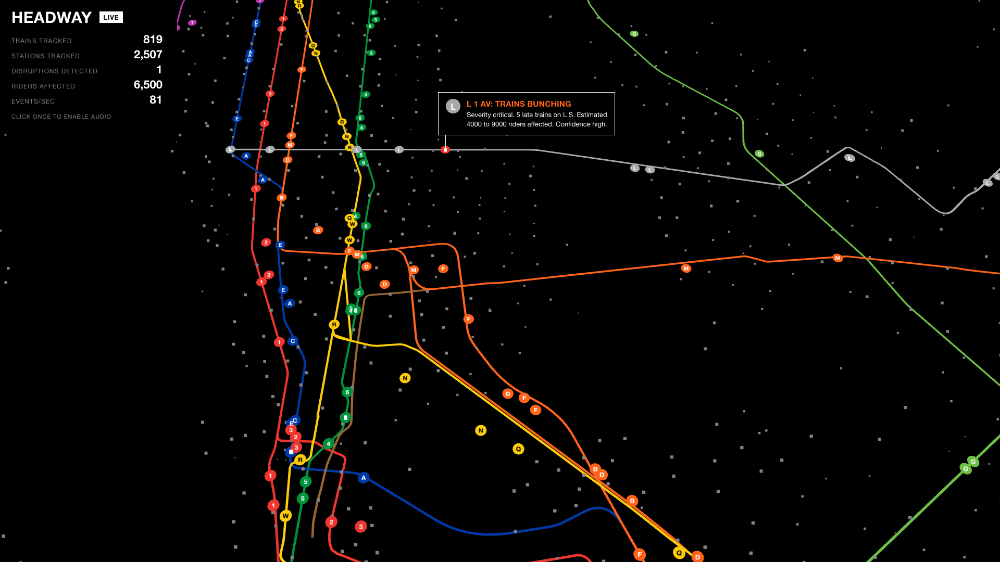
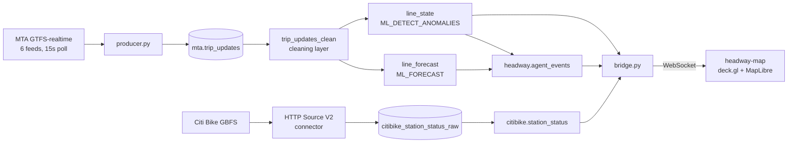

# Headway



<sub>Live capture: 819 trains tracked from six MTA feeds, 2,507 Citi Bike stations,
and a critical disruption detected on the L — five bunched trains southbound at
1 Av, with the stalled train drawn in red beneath the card.</sub>

Real-time detection of subway disruption on the NYC transit network. Live MTA
GTFS-realtime feeds stream into Confluent Cloud, Flink SQL finds lines whose delay
is anomalous against their own history and forecasts where they are heading, and a
wall display renders the result as a map that looks like it belongs in a station.

Nothing here is simulated except a deliberate injector used to rehearse the
failure case. The train positions, the delays, the Citi Bike dock counts and the
station geometry are all live.

---

## What it does

Every 15 seconds it polls six MTA GTFS-realtime feeds — roughly 15,000 upcoming-stop
events per cycle across ~700 trains — and writes them to Kafka as Avro. Flink then:

1. **Cleans** the raw feed: deduplicates by `(trip_id, stop_id)`, drops rows with
   missing coordinates or impossible delays, normalizes route IDs and vehicle status,
   and derives direction from the NYCT stop-ID suffix.
2. **Aggregates** into 60-second windows per route and direction, counting active and
   late trains and locating the worst-delayed stop.
3. **Detects anomalies** with `ML_DETECT_ANOMALIES`, comparing each line's average
   delay against its own recent history rather than a fixed threshold.
4. **Forecasts** ten minutes ahead with `ML_FORECAST` (TimesFM) to flag bunching
   before it happens.
5. **Emits rider-facing alerts** deterministically — no LLM, no model, no connection
   object — as `headway.agent_events`.

A bridge fans those topics out over WebSocket to the map.



---

## Layout

```
headway-ingest/     Python: producer, replay, injector, Kafka→WebSocket bridge
  src/producer.py   Polls the six MTA feeds, emits one event per upcoming stop
  src/common.py     Config, idempotent producer, Avro serialization, topic admin
  bridge.py         Consumes Kafka, reconstructs train legs, serves WebSocket
  replay.py         Replays a recorded window at N× speed, timestamp-ordered
  inject.py         Synthetic stalled-train cascade for rehearsing the demo
  schemas/          Avro schema for mta.trip_updates

flink/              The four SQL statements, in dependency order
headway-map/        Vite + deck.gl + MapLibre wall display
  scripts/preprocess.mjs   GTFS shapes.txt → GeoJSON, Citi Bike station positions
  scripts/fake-server.mjs  Stand-in feed for developing without Confluent
```

---

## Setup

### Credentials

Confluent Cloud issues a separate API key per resource; they are not
interchangeable. Copy `headway-ingest/.env.example` to `headway-ingest/.env` and
fill in six values:

| Variable | Where it comes from |
|---|---|
| `BOOTSTRAP` | Cluster settings → Endpoints. Strip the `SASL_SSL://` prefix. |
| `SASL_USERNAME` / `SASL_PASSWORD` | A **cluster** API key (`lkc-…`). The key is the username. |
| `SR_URL` | Environment → Stream Governance → Endpoint |
| `SR_API_KEY` / `SR_API_SECRET` | A **Schema Registry** API key (`lsrc-…`) |

The cluster key cannot authenticate to Schema Registry, which is the most common
setup mistake. `.env` is gitignored.

### Ingest

```bash
cd headway-ingest && make setup
```

`make dry-run` parses one live fetch from all six feeds and prints a sample event
without touching Kafka — worth running first to confirm the feeds respond.

```bash
make run
```

Creates `mta.trip_updates` (6 partitions, keyed by `route_id`) if missing and
begins recording. The producer is idempotent with `acks=all` and a 15-minute
`message.timeout.ms`, so it rides out broker outages without dropping events.

### Map

```bash
cd headway-map && npm install && npm run preprocess && npm run dev
```

`preprocess` downloads the MTA static GTFS and builds `public/subway.geojson`
(174 line shapes, 29 routes) plus Citi Bike station positions. Both are committed,
so this is only needed to refresh them.

---

## Running it

**Against the live pipeline** — start the bridge, then open the map pointed at it:

```bash
cd headway-ingest && .venv/bin/python bridge.py --source live --port 8788
```

Then `http://localhost:5173/?ws=ws://localhost:8788`.

**Without Confluent** — a fake feed with 400 trains, 2,500 stations and an alert
every 8 seconds, useful for working on the display:

```bash
cd headway-map && npm run fake
```

Then `http://localhost:5173`.

**Rehearsing a disruption** — injects an L train stalled at Bedford Av with delay
growing 60s → 900s, followed by four trailing trains with compounding delays and
shrinking headways. Flows through the real pipeline and surfaces as a card:

```bash
cd headway-ingest && make inject
```

**Replaying a recorded morning** at 20× speed, preserving relative timing across
partitions:

```bash
cd headway-ingest && make replay START=2026-09-04T07:30 SPEED=20
```

### Display controls

| Key | Effect |
|---|---|
| `R` | Toggle the LIVE / REPLAY 20× badge |
| `Q` | Full-screen QR overlay, URL from `?qr=` |
| click | Enable audio (a two-tone chime on critical alerts) |

`?basemap=light` switches the black field to white.

---

## Design notes

**The map is deliberately austere.** The only colors on screen are official MTA
route colors; everything else is black, white and one grey. No glow, no gradients,
no easing. Cards cut in and out hard, like a platform countdown clock.

**Trains interpolate, they don't teleport.** A GTFS `trip_update` reports the next
stop, not a completed leg, and the same stop repeats for minutes while a train
approaches it. The bridge tracks the leg a train is riding — the stop it last
passed and the one it is approaching — and emits a 15-second slice of that journey,
which is what produces smooth motion at a realistic ~25 km/h.

**`late_trains` counts distinct trips.** The feed emits one row per upcoming stop,
so counting rows inflates a single late train roughly fortyfold and makes the
rider estimates absurd.

**The cleaning layer uses window deduplication.** Keep-last-row deduplication emits
retractions, which an append-only sink cannot consume. Tumbling the dedup means the
window closes and emits exactly once.

**Alerts are deterministic.** `headway.agent_events` is built from string and
arithmetic expressions only. The anomaly detection and forecasting use Confluent's
built-in `ML_DETECT_ANOMALIES` and `ML_FORECAST`, which need no `CREATE MODEL` and
no connection object.

---

## Data sources

- [MTA GTFS-realtime](https://api.mta.info/) — six subway feeds, no API key required
- [MTA static GTFS](https://rrgtfsfeeds.s3.amazonaws.com/gtfs_subway.zip) — stop
  names, coordinates and line geometry
- [Citi Bike GBFS](https://gbfs.citibikenyc.com/gbfs/2.3/en/station_status.json) —
  2,507 stations, no API key required
